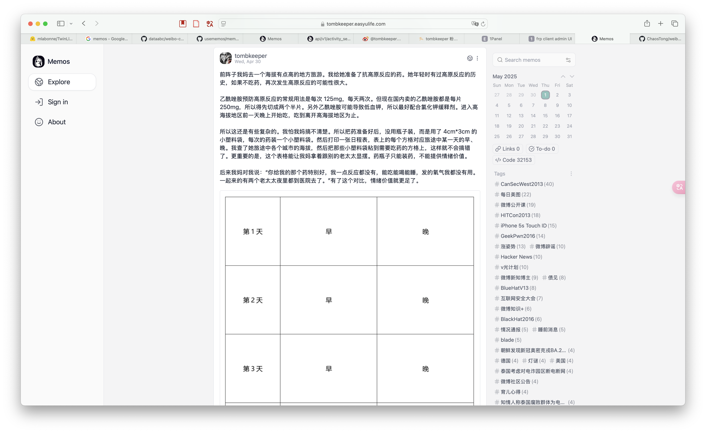

使用 [Weibo Crawler](https://github.com/dataabc/weibo-crawler) 爬取weibo用户数据, 按照 [memos](https://github.com/usememos/memos) 数据格式要求, 导入用户, timeline数据以及本地图片/视频等资源关系

[demo site](https://tombkeeper.easyulife.com/explore)


提供 sqlite 和 mysql 导入脚本.
设置增量更新, 可动态更新.

修改爬虫项目 `__main__.py`
```python
import argparse
from time import sleep

import schedule

import const
import weibo
from util.notify import push_deer

import os
import sys
import subprocess

# 获取 Python 解释器的路径 (建议用绝对路径)
python_executable = sys.executable
rootPath = '/Users/mini4chaos/Developer/weibo-crawler/'
# 定义要执行的脚本的绝对路径
# weibo 数据 导入 memos 表
script1_path = os.path.abspath(rootPath+"weibo2memos.py")
# 更新 图片等资源 到 memo resource 表
script2_path = os.path.abspath(rootPath+"resources_bind.py")
# 更新 转发关系
script3_path = os.path.abspath(rootPath+"memo_relation.py")

# 新建 转发用户
script4_path = os.path.abspath(rootPath+"retweet_user.py")
# 更新 标签
script5_path = os.path.abspath(rootPath+"update_tags.py")

def run_script(script_path):
    """执行指定的 Python 脚本"""
    print(f"[{time.strftime('%Y-%m-%d %H:%M:%S')}] Running script: {script_path}")
    try:
        # 使用 subprocess.run 来执行脚本，并捕获输出
        # cwd 参数设置脚本的工作目录，有助于处理相对路径
        script_dir = os.path.dirname(script_path)
        result = subprocess.run(
            [python_executable, script_path],
            capture_output=True,
            text=True,
            check=True, # 如果脚本出错（返回非零退出码），则抛出 CalledProcessError
            cwd=script_dir # 设置工作目录为脚本所在目录
        )
        print(f"Output of {os.path.basename(script_path)}:\n{result.stdout}")
        if result.stderr:
            print(f"Error output of {os.path.basename(script_path)}:\n{result.stderr}", file=sys.stderr)
    except FileNotFoundError:
        print(f"Error: Python executable or script not found at {script_path}", file=sys.stderr)
    except subprocess.CalledProcessError as e:
        print(f"Error running script {script_path}. Return code: {e.returncode}", file=sys.stderr)
        print(f"Stdout:\n{e.stdout}", file=sys.stderr)
        print(f"Stderr:\n{e.stderr}", file=sys.stderr)
    except Exception as e:
        print(f"An unexpected error occurred while running {script_path}: {e}", file=sys.stderr)


def main(schedule_interval):
    """
    主函数，用于设置定时任务和执行微博爬虫脚本。

    Parameters:
        schedule_interval (int): 循环间隔，以分钟为单位。

    Returns:
        None
    """
    schedule.every(schedule_interval).minutes.do(weibo.main)  # 每隔指定的时间间隔执行一次main函数
    weibo.logger.info('循环间隔设置为%d分钟', schedule_interval)

    schedule.every().hour.at(":30").do(run_script, script_path=script1_path)
    schedule.every().hour.at(":35").do(run_script, script_path=script2_path)
    schedule.every().hour.at(":40").do(run_script, script_path=script3_path)

    schedule.every(12).hours.at(":45").do(run_script, script_path=script4_path)
    schedule.every(12).hours.at(":50").do(run_script, script_path=script5_path)

    weibo.main()  # 立即执行一次
    while True:
        try:
            schedule.run_pending()
            sleep(1)
        except KeyboardInterrupt:
            schedule.cancel_job(weibo.main)
            break
        except Exception as error:
            if const.NOTIFY["NOTIFY"]:
                push_deer(f"weibo-crawler运行出错, 错误为{error}")
                weibo.logger.exception(error)

if __name__ == "__main__":
    parser = argparse.ArgumentParser()
    parser.add_argument('schedule_interval', type=int, help='循环间隔（分钟）')
    args = parser.parse_args()

    main(args.schedule_interval)

```